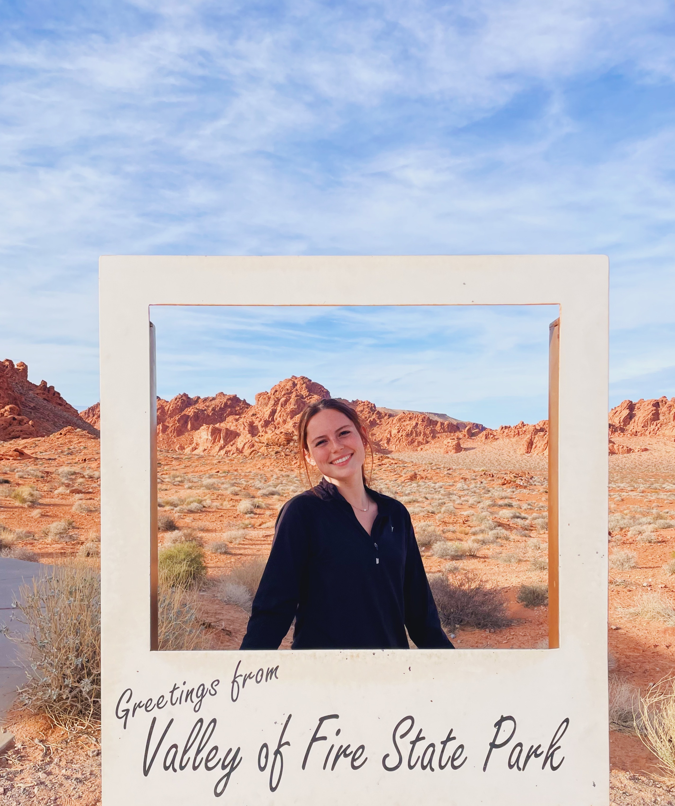

# Aubrey's Practice Space ✨

 

 ### Hi! 👋
My name is Aubrey. I am an undergraduate environmental engineering student learning to be a nerd lol. 

This repository is to learn GitHub & Practice coding in Juypter Notebook. 

I want to learn: 
  - data science processing 
   - image processing
   - small skills, like loops 
   - AI, machine learning, and deep learning concenpts
   - markdown (as seen in this readme.md)✔️ 

 

 

## Connect with me!

## Visual Code Studio

